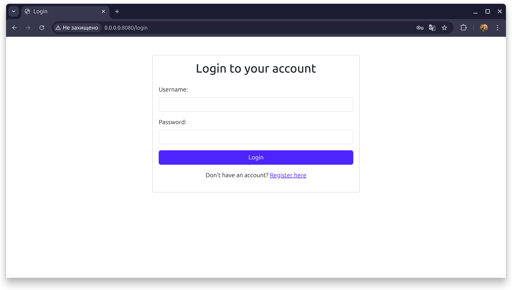
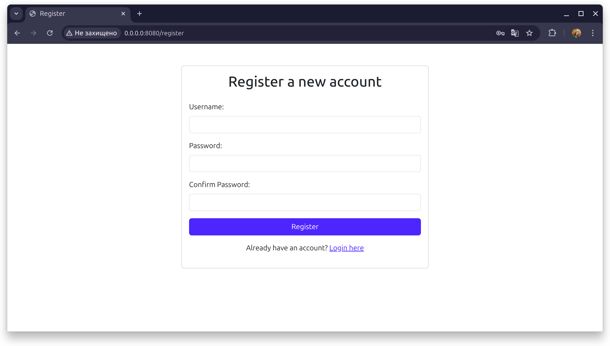
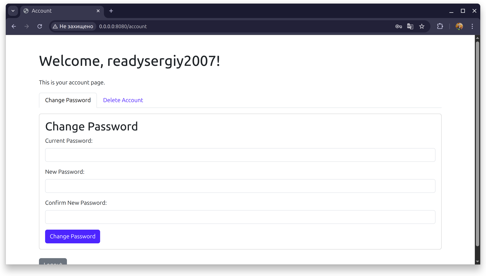

# WebAuth

> [!CAUTION]
> **Proof-of-Concept Software Notice**
>
> This software is a proof-of-concept and is intended for demonstration and educational purposes only. It is not designed for production environments and **should not be used on live servers**.
>
> - **Not recommended for production servers.** The author **is not responsible** for any damages or security vulnerabilities caused by its use.
> - This software is **not** offered as a stable, evolutionary solution or a finished product.
>
> Use it at your own risk.

[](https://poggit.pmmp.io/ci/newlandpe/WebAuth/WebAuth)

A simple web-based authentication panel for PocketMine-MP, providing basic account management functionalities through a web interface.

## Features

- **Web-based Registration:** Users can register new accounts through a web form.
- **Web-based Login:** Users can log in to their accounts via a web form.
- **Account Management Panel:**
  - **Change Password:** Users can change their account password.
  - **Delete Account:** Users can permanently delete their account.
- **Basic Styling:** A clean and simple web interface with basic CSS styling.
- **Tabbed Interface:** Account management features are organized into tabs for better user experience.

## Installation

1. Ensure you have the `pmmp-webserver` virion installed and configured in your PocketMine-MP server.
2. Place the `WebAuth.phar` file (or the `WebAuth` plugin folder) into the `plugins/` folder of your PocketMine-MP server.
3. Restart your server.
4. The web panel will be accessible via the configured host and port of the `pmmp-webserver` (default: `http://0.0.0.0:8080`). Navigate to `/login` or `/register`.

## Configuration

The plugin generates a `config.yml` file in `plugin_data/WebAuth/` upon first run.
Currently, the only configurable options are the web server `host` and `port`.

```yaml
# Web server host (default: 0.0.0.0)
host: 0.0.0.0
# Web server port (default: 8080)
port: 8080
```

## Usage

This plugin provides both web-based and in-game methods for authentication.

### Web Interface

After installing and configuring the plugin, the web panel will be accessible via the configured host and port of the `pmmp-webserver` (default: `http://0.0.0.0:8080`).

- **Login Page:** Navigate to `/login` to access the login form.
  

- **Registration Page:** Navigate to `/register` to create a new account.
  

- **Account Management:** After logging in, you will be redirected to your account page where you can manage your password.
  

### In-game Commands

You can also use the following commands directly in-game:

- `/register <password> <confirm_password>`: Registers a new account.
- `/login <password>`: Logs into your registered account.

## Contributing

Contributions are welcome and appreciated! Here's how you can contribute:

1. Fork the project on GitHub.
2. Create your feature branch (`git checkout -b feature/AmazingFeature`).
3. Commit your changes (`git commit -m 'Add some AmazingFeature'`).
4. Push to the branch (`git push origin feature/AmazingFeature`).
5. Open a Pull Request.

Please make sure to update tests as appropriate and adhere to the existing coding style.

## License

This project is licensed under the CSSM Unlimited License v2 (CSSM-ULv2). Please note that this is a custom license. See the [LICENSE](LICENSE) file for details.
